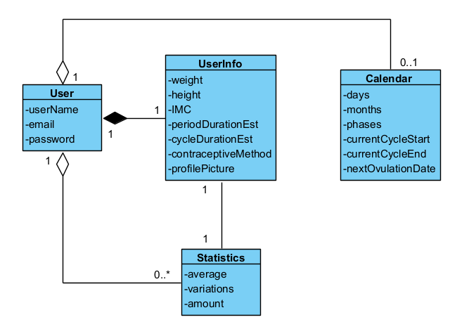

[REQUISTOS PARA CORRECTA EJECUCION]:
- Tener instalado node.js
- Ejecutar comando [npm run dev] para inicializar Tailwind

Link Figma con Sugerencias:
https://www.figma.com/proto/Ix1O6INxrJjqv3e5WJtliI/Proyecto-de-Aplicación---MoonBloom?node-id=601-11&t=zN2ZjVMzOF8m1SFe-1

Nombre Proyecto: MoonBloom

Integrantes: 
Valentina Cifuentes
Viviana Castro
Benjamín Merino

Descripción Proyecto:
Desarrollo de calendario menstrual como herramienta útil para ayudar a las personas a rastrear su ciclo menstrual, identificar patrones, y planificar en torno a la salud reproductiva.

Funcionalidades:

Viviana Castro:

- Calendario de ciclo menstrual: La funcionalidad permite al usuario la visualización del ciclo menstrual en un calendario interactivo.

Requerimientos:
El sistema debe mostrar los próximos días de ovulación y destacar los más fértiles.
El sistema debe mostrar los próximos días de periodo.
El sistema debe mostrar los registros de relaciones sexuales
El sistema debe mostrar los registros de meses pasados (hasta el primer mes con registro).
El sistema debe mostrar las predicciones de hasta 3 meses futuros.
El sistema debe actualizar las fechas del ciclo en caso de que un registro menstrual influya en la predicción inicialmente propuesta.
El sistema debe permitir seleccionar y acceder a un día.

- Acceder a día: La funcionalidad permite al usuario la visualización detallada del día seleccionado.

Requerimientos:
El sistema debe mostrar la fecha del día seleccionado.
El sistema debe mostrar la fase del ciclo en el que se encuentra.
El sistema debe permitir al usuario crear o eliminar registros de relaciones sexuales hasta el día presente, en el que se podrá señalar si fue con o sin protección.
El sistema debe permitir al usuario crear o eliminar registros de período hasta el día presente.

- Resumen del día: La funcionalidad permite al usuario la visualización de un resumen de datos del día presente.

Requerimientos:
El sistema debe mostrar la fecha del día.
El sistema debe mostrar la fase del ciclo en el que se encuentra.
El sistema debe mostrar cuántos días faltan para el periodo.
El sistema debe mostrar una advertencia en caso de presentar un retraso en el periodo.
El sistema debe mostrar la probabilidad de embarazo del día.

- Consejo del día: La funcionalidad muestra al usuario consejos respecto a la fase del ciclo menstrual en el que se encuentre.
El sistema debe mostrar consejos para afrontar la fase del ciclo.
    
- Pestaña de información: La funcionalidad permite al usuario acceder a información variada.
El sistema debe mostrar información sobre el ciclo menstrual.
El sistema debe mostrar información sobre métodos anticonceptivos.
El sistema debe mostrar información sobre enfermedades del sistema uterino/reproductor.

Benjamín Merino:

- Registro Usuario: La funcionalidad permite al usuarios registrarse en la aplicación usando credenciales válidas e información de su ciclo.

Requerimientos:
El sistema debe contar con un formulario de registro en el cual el usuario debe ingresar un correo, nombre de usuario y contraseña.
El sistema debe validar la entrada de la contraseña para garantizar la seguridad (letras mayúscula y minúscula, números y caracteres especiales).
El sistema debe contar con una pregunta de respuesta personal para verificar la identidad del usuario en caso de olvidar la contraseña.
El sistema debe solicitar al usuario la fecha de inicio y término de su último periodo.
El sistema debe solicitar al usuario la duración estimada de su ciclo.
El sistema debe solicitar al usuario la duración estimada de su periodo.
El sistema debe solicitar al usuario registrar métodos anticonceptivos internos que puedan alterar el ciclo, en caso de tener alguno.
El sistema debe solicitar al usuario su peso y altura.

- Inicio Sesión: La funcionalidad permite al usuario iniciar sesión.

Requerimientos:
El sistema debe permitir al usuario ingresar a la aplicación ingresando un correo electrónico y contraseña previamente registrado.
El sistema debe permitir al usuario responder una pregunta personal en caso de olvidar la contraseña.

- Información de usuario: La funcionalidad permite al usuario visualizar su información y acceder a demás configuraciones.

Requerimientos:
El sistema debe permitir al usuario ver y seleccionar una foto de perfil (avatares predeterminados).
El sistema debe permitir al usuario ver y cambiar su nombre de usuario.
El sistema debe permitir al usuario ver y cambiar la duración estimada de su ciclo.
El sistema debe permitir al usuario ver y cambiar la duración estimada de su periodo.
El sistema debe permitir al usuario ver, cambiar o eliminar métodos anticonceptivos internos que puedan alterar el ciclo, en caso de tener alguno.
El sistema debe permitir al usuario ver, cambiar o eliminar su peso y altura.
El sistema debe calcular y mostrar el IMC del usuario (peso/altura^2).

Valentina Cifuentes:

- Análisis de Ciclo: La funcionalidad analiza los datos de los ciclos menstruales anteriores considerando los datos entregados por el usuario (peso, altura, anticonceptivos).

Requerimientos:
El sistema procesa los datos para estimar la duración del ciclo completo.
El sistema procesa los datos para predecir las fechas de cada fase (menstruación, ovulación, lutea y folicular) de los próximos 3 meses.
El sistema procesa los datos para estimar la duración de cada fase del ciclo.

- Resumen y estadísticas: La funcionalidad calcula y muestra resúmenes detallados de cada ciclo menstrual.

Requerimientos:
El sistema debe mostrar la duración promedio, variaciones, anomalías y la influencia del método anticonceptivo (en caso de registrar uno) de los ciclos registrados hasta el momento.
El sistema debe mostrar la duración promedio, variaciones, anomalías y la influencia del método anticonceptivo (en caso de registrar uno) de los periodos registrados hasta el momento.
El sistema debe mostrar la tendencia de los días a ovular, variaciones y anomalías en base a lo registrado hasta el momento.
El sistema debe mostrar la cantidad de veces, fase con más registros, cantidad y tendencia con y sin protección de la actividad sexual por cada ciclo en base a lo registrado hasta el momento, además de las causales de riesgo de embarazo en caso de que haya un retraso del periodo. 

- Gráficos: La funcionalidad desarrolla y muestra al usuario gráficas de los resúmenes.

Requerimientos:
El sistema debe mostrar un gráfico de líneas de la duración de los ciclos registrados hasta el momento.
El sistema debe mostrar un gráfico de líneas de la duración de los días menstruales registrados hasta el momento.
El sistema debe mostrar un gráfico de líneas de los días ovulatorios registrados hasta el momento.
El sistema debe mostrar un gráficos de barras del número de relaciones sexuales con protección y sin protección por fase, para cada ciclo menstrual registrado hasta el momento.

Diagrama de Dominio:

Contrato Endpoint:

1. Endpoint: /register
Tipo de solicitud: POST
Descripción: Permite al usuario registrarse en la página ingresando datos importantes para el funcionamiento del calendario menstrual.
Contenido esperado (Request body):
{ 
"userName": "String", 
"email": "String", 
"password": "String", 
"confirmPassword": "String", 
"securityQuestion": "String", 
"securityAnswer": "String",
"weight": "Int", 
"height": "Int",
"startPeriod": "String",
"endPeriod": "String",
"cycleDuration": "Int",
"periodDuration": "Int",
"contraceptiveMethod": "String”
}
Rol de autorización: Ninguno.

2. Endpoint: /password/recover
Tipo de solicitud: POST
Descripción: Permite al usuario validar su identidad respondiendo a la pregunta de seguridad para luego poder cambiar su contraseña.
Contenido esperado (Request body):
{
"email": "String",
"securityQuestion": "String", 
"securityAnswer": "String"
}
Rol de autorización: Ninguno.

3. Endpoint: /password/change
Tipo de solicitud: POST
Descripción: Permite al usuario cambiar su contraseña después de validar su identidad.
Contenido esperado (Request body):

{
"newPassword": "String",
"confirmPassword": "String"
}
Rol de autorización: Usuario autenticado.

4. Endpoint: /login
Tipo de solicitud: POST
Descripción: Permite al usuario iniciar sesión en la página.
Contenido esperado (Request body):
{
"email": "String",
"contraseña": "String"
}
Rol de autorización: Ninguno.

5. Endpoint: /statistics
Tipo de solicitud: GET
Descripción: Muestra estadísticas detalladas sobre el ciclo menstrual del usuario basado en su historial.
Contenido esperado (Request headers):
Autorización: Bearer Token
Respuesta esperada (Response body):
{
  "avgCycleDuration": "number", 
  "avgMenstrualPhaseDuration": "number",  
  "avgDayOfOvulation": "Int", 
  "cycleData": [
    {
      "cycleLength": "Int", 
      "startPeriod": "Date", 
      "endPeriod": "Date",
      "fertileDays": ["Date"],  
      "ovulationDay": "Date", 
      "protectedSex": "Int", 
      "unprotectedSex": "Int", 
      "mostActivePhase": "String" 
    }
  ]
}

Rol de autorización: Usuario autenticado.

6. Endpoint: /user/profile
Tipo de solicitud: GET
Descripción: Muestra la información personal del usuario.
Contenido esperado (Request headers):
Autorización: Bearer Token
Respuesta esperada (Response body):
{
"userName": "String", 
"weight": "Number",
"height": "Number",
"imc": "Number",
"profilePicture": "String", 
"period_duration_est": "Number",
"cycle_duration_est": "Number", 
"anticonceptive_method": "String"
}
Rol de autorización: Usuario autenticado.

7. Endpoint: /user/update
Tipo de solicitud: PUT
Descripción: Permite al usuario actualizar su información personal, incluyendo detalles del ciclo menstrual.
Contenido esperado (Request body):
{
"anticonceptive_method": "String",
"weight": "Number",
"height": "Number",
"imc": "Number",
"profilePicture": "String", 
"cycleDuration": Number,
"periodDuration": Number
}
Rol de autorización: Usuario autenticado.

8. Endpoint: /logout
Tipo de solicitud: POST
Descripción: Finaliza la sesión del usuario y lo redirige a la vista de inicio de sesión.
Contenido esperado: Ninguno.
Rol de autorización: Usuario autenticado.

9. Endpoint: /calendar
Tipo de solicitud:GET 
Descripción: El calendario calcula y muestra las fechas importantes del ciclo menstrual del usuario.
Contenido esperado (Response body):
{
 "months": ["String"], 
"actualMonth": "Int", 
"daysInMonths": ["Int"], 
"firstDays": ["Int"], 
"weekDays": ["String"], 
"phases": { 
"menstrual": ["Int"], 
"folicular": ["Int"], 
"fertile": ["Int"], 
"ovulation": ["Int"], 
"luteal": ["Int"], 
"currentDay": "Int"
},
"startPeriod": "String",
"endPeriod":”String”,
"cycleDuration": "Int",
"periodDuration": "Int",
"sexualActivityRecords": [
 {
 "date": "String", 
"protected": "Boolean" } ]}
Rol de autorización: Usuario autenticado.

10.Endpoint: /popup
Tipo de solicitud: GET
Descripción: El popup muestra información sobre el día seleccionado, incluyendo la fecha, fase del ciclo menstrual y registros de actividad sexual.
Contenido esperado (Response body):
{
"actualDate":”String”,
"currentPhase":"String",
"sexualActivityRecords": [
 {
 "date": "String", 
"protected": "Boolean" } ]}

11. Endpoint: /popup
Tipo de solicitud: PUT
Descripción:  El popup permite guardar registros de actividad sexual y del periodo, y actualiza el calendario con la nueva información.
Contenido esperado (Request body):
{
"sexualActivityRecords": [
 {
 "date": "String", 
"protected": "Boolean" } ]
}
Rol de autorización: Usuario autenticado.

12. Endpoint: /daySummary
Tipo de solicitud: GET
Descripción: Muestra un resumen del día seleccionado, incluyendo la fecha, fase del ciclo, días restantes para el periodo y la probabilidad de embarazo.
Contenido esperado (Response body)
{
         "actualDate":”String”,
          "currentPhase":"String",
          "daysLeftPeriod":Int,
          "pregnancyProbability": "String"
}
Rol de autorización: Usuario autenticado.
13. EndPoint: /dailyAdvice
Tipo de solicitud: GET
Descripción: Muestra consejos de estilo de vida basados en la fase del ciclo menstrual en la que se encuentra el usuario.
Contenido esperado (Response body)
{
"adviceData":{  
      "content":"String"
}
}
Rol de autorización: Usuario autenticado.

